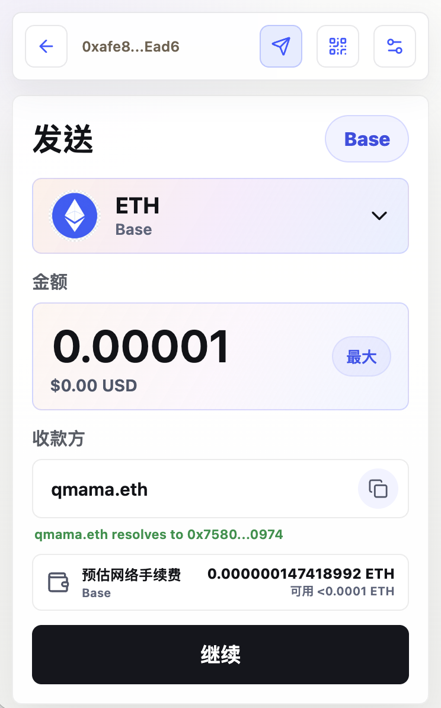
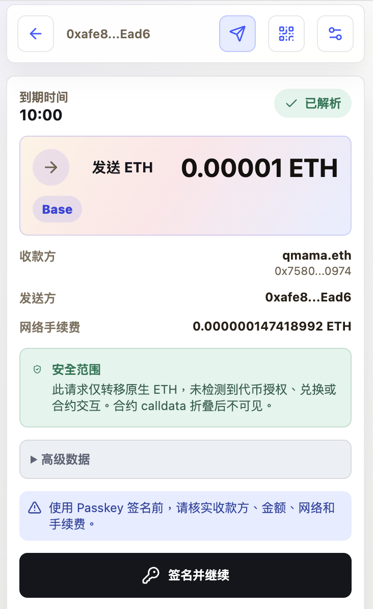
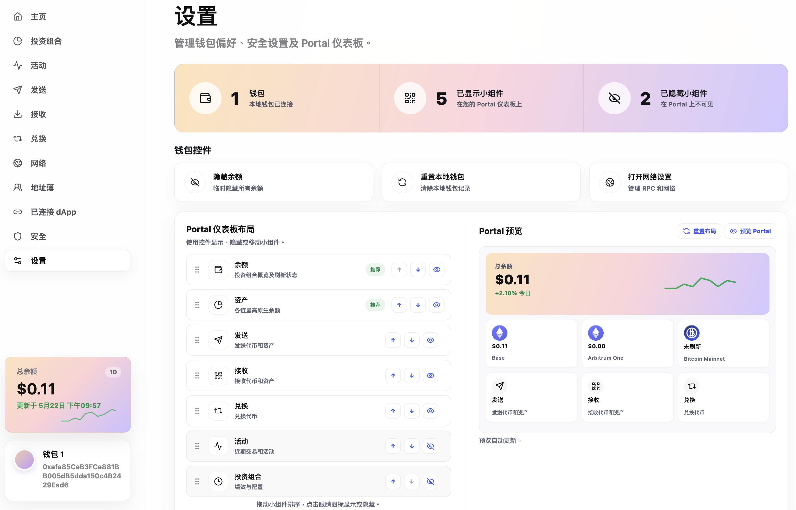
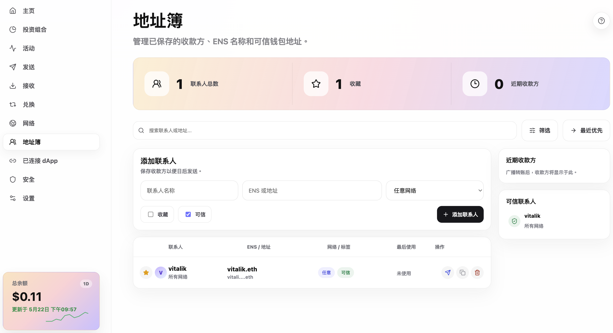
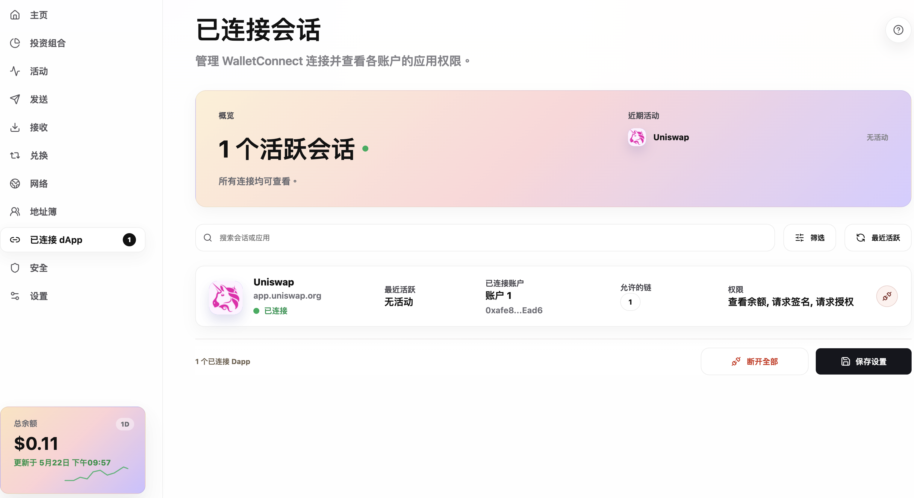

# Orchard Wallet

A self-custody, multichain crypto wallet for Chrome — unlocked by a
WebAuthn passkey, designed around Clear Signing, and built to feel
minimal.

No seed phrase. No password. Your passkey is the key.

**Languages:** English · [繁體中文](README.zh-TW.md) · [简体中文](README.zh-CN.md)

---

## Screenshots

<table>
  <tr>
    <td width="50%" valign="top">
      
      <p align="center"><sub>Send with ENS resolution and live fee estimation</sub></p>
    </td>
    <td width="50%" valign="top">
      
      <p align="center"><sub>Clear Signing preview with safe-scope detection and expiry</sub></p>
    </td>
  </tr>
  <tr>
    <td width="50%" valign="top">
      
      <p align="center"><sub>Drag-and-drop Portal dashboard with live preview</sub></p>
    </td>
    <td width="50%" valign="top">
      
      <p align="center"><sub>Address book with ENS, trusted contacts, and recent recipients</sub></p>
    </td>
  </tr>
  <tr>
    <td colspan="2" valign="top">
      
      <p align="center"><sub>WalletConnect v2 — manage live dApp sessions, accounts, and permissions</sub></p>
    </td>
  </tr>
</table>

## Highlights

### Passwordless, by design

The wallet has no seed phrase and no password. A WebAuthn passkey with
the PRF extension derives the symmetric key that unlocks a local
`tcx-wasm` keystore. Every signing operation requires a fresh passkey
assertion — phishing-resistant by construction, and immune to clipboard
or memory-scraping attacks on stored secrets.

### Clear Signing, not blind signing

Before any signature, you see exactly what you're signing in human
terms: recipient, amount, network, fee. The wallet automatically detects
plain-ETH transfers and tags them as a **safe scope** ("no token
approval, swap, or contract interaction"). Complex calldata is folded
behind an expandable panel. A countdown to expiry prevents an old
preview from being signed against a stale gas market.

### Customizable Portal dashboard

The popup is not a fixed layout. Choose which widgets appear — Balance,
Assets, Send, Receive, Swap, Activity, Portfolio — and drag to reorder.
A live preview in Settings shows exactly what your popup will look like
before you save.

### Multichain, in one wallet

EVM (Ethereum, Arbitrum, Base, Polygon, Hyperliquid, …), Bitcoin, and
TRON, in a single keystore. Add your own custom RPCs from Settings.

### Native ENS resolution

Type `vitalik.eth` instead of `0xd8dA...`. Resolution uses viem ENS
actions, Universal Resolver, and CCIP Read gateways — ENS v2 ready. The
resolved address is shown in the Send flow before you confirm, and ENS
contacts can be saved as trusted entries in the Address Book.

### Two ways to connect dApps

- **Desktop dApps** — the extension injects an EIP-1193 / EIP-6963
  Ethereum provider into every page. Modern dApps detect it
  automatically.
- **Mobile dApps** — pair via WalletConnect v2 with a QR code. A
  dedicated session manager shows live connections, connected accounts,
  permitted chains, granted permissions, and lets you disconnect at any
  time.

### Built-in DeFi widgets

- **Swap (Settings → Swap)** — indicative prices and firm AllowanceHolder
  quotes via the 0x API across a curated token list.
- **pufETH convert** — one-click ETH → pufETH liquid restaking through
  Puffer Finance, with a Clear Signing preview.

### Multi-language UI

English, 繁體中文, 简体中文, 日本語 — switch at runtime from Settings.
Selection persists in `chrome.storage.local`.

---

## Security model

| Layer | What protects it |
|---|---|
| Authentication | WebAuthn passkey (PRF extension), managed by the OS / browser secure enclave |
| Keystore encryption | Symmetric key derived from passkey PRF output (never persisted) |
| Key material | `@consenlabs/tcx-wasm` — keys exist only in WASM memory at signing time |
| Persistence | `chrome.storage.local` only — no cloud sync, no remote backup |
| Outbound traffic | Only the endpoints listed in [Privacy Policy](docs/privacy-policy.md) — no analytics, no telemetry |

The private key never leaves your device. Read the
[Privacy Policy](docs/privacy-policy.md) for the full list of outbound
endpoints and what is sent to each.

## Supported networks

Ethereum Mainnet · Arbitrum One · Base · Polygon · Hyperliquid ·
Bitcoin (mainnet, testnet, signet) · TRON (mainnet, Shasta, Nile) ·
Sepolia and other testnets · plus **custom RPCs** for any EVM chain.

---

## Install

### From source

Build-time environment variables (set in `.env`):

```bash
VITE_WALLETCONNECT_PROJECT_ID=your_walletconnect_project_id
VITE_ZERO_EX_API_KEY=your_0x_api_key
```

Both are optional. WalletConnect and the Swap widget degrade gracefully
when their key is absent.

```bash
npm install
npm run build
```

Then in Chrome:

1. Open `chrome://extensions`.
2. Enable **Developer mode**.
3. Click **Load unpacked** and select the `dist/` directory.

### UI-only development

For iterating on popup / settings UI without rebuilding the extension:

```bash
npm run dev -- --port 5173
```

Then open `http://127.0.0.1:5173/src/popup/index.html` or
`.../src/settings/index.html`. `chrome.*` APIs are stubbed and storage
falls back to `localStorage`.

## Package for the Chrome Web Store

```bash
npm run package
```

Builds and zips `dist/` into `orchard-wallet.zip` with `manifest.json`
at the archive root. Bump `version` in `public/manifest.json` before
each store update.

## Languages

UI ships with four locales — `en`, `zh-cn`, `zh-tw`, `ja-jp`. The
language is chosen in **Settings → Settings** and persists in
`chrome.storage.local`. On first run, the wallet picks a language from
the browser locale, defaulting to English.

Translations are bundled JSON catalogs under `src/i18n/locales/<locale>/`,
split into `common`, `popup`, and `settings` namespaces. To add or
change a string: edit `en` first, mirror the key into the other three
locales, then run `node scripts/check-i18n-parity.mjs` to confirm parity.

## Architecture

```text
src/popup/App.tsx                     Popup workflow and UI state
src/settings/SettingsApp.tsx          Settings, networks, swap, Portal layout
src/background.ts                     MV3 service worker (RPC, WalletConnect, alarms)
src/content/providerBridge.ts         Page <-> background CustomEvent bridge
src/inpage/ethereumProvider.ts        EIP-1193 / EIP-6963 provider injected into pages
src/core/webauthn.ts                  WebAuthn PRF credential creation and unlock
src/core/tcx.ts                       tcx-wasm init, keystore creation, account derivation
src/core/clearSigning.ts              Clear Signing transaction intent builder
src/core/ens.ts                       ENS forward / reverse resolution adapter
src/core/networks.ts                  Built-in network and RPC settings
src/core/rpc.ts                       EVM RPC balance, fee, gas, nonce, broadcast
src/core/{evm,tron,bitcoin}Assets.ts  Per-chain balance refreshers
src/core/portfolio.ts                 Normalized multichain asset store
src/core/zeroEx.ts                    0x AllowanceHolder swap quotes
src/core/puffer.ts                    Puffer pufETH rate and TVL
src/i18n/index.ts                     i18next setup and runtime language switch
src/lib/storage.ts                    chrome.storage.local with localStorage fallback
```

Deeper dives:

- [Multichain asset architecture](docs/multichain-assets-architecture.md)
- [Orchard UI implementation plan](docs/orchard-ui-implementation-plan.md)

## Privacy

See the full [Privacy Policy](docs/privacy-policy.md) — every outbound
endpoint, what is sent to it, and what is stored on your device.
